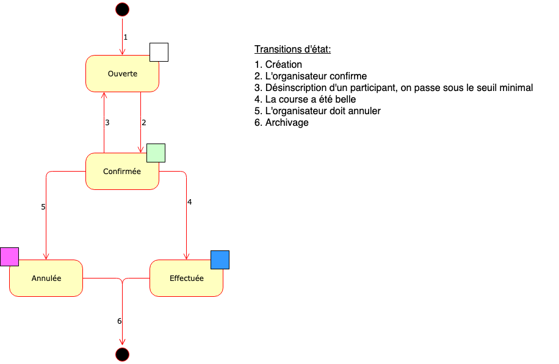

# Spécification initiale

Hixe fonctionne en complément du [site](http://www.clubalpinsion.ch) du Club Alpin Suisse, groupe de Sion (CASS).

L'accès à Hixe est limité aux membres du CASS, il est contrôlé au moyen du login/mot de passe de l'utilisateur sur le site.

Le site est fait avec Joomla, l'authentification se fait au moyen du [plugin Joomla IDP](https://plugins.miniorange.com/joomla-idp-saml-sso).

## Acteurs

Les personnes utilisant Hixe sont

- Les administrateurs, qui gèrent le site
- Les guides, qui organisent des courses
- Les participants, qui prennent part aux courses

Les personnes ne sont pas cantonnées à un seul rôle. Un administrateur, par exemple, peut être guide d'une course et participant dans une autre.

### Caractéristiques obtenues à partir du site

Lors de l'authentification auprès du site, Hixe récupère les informations suivantes au sujet de l'utilisateur:

- Prénom
- Nom
- Adresse email
- Numéro de membre
- Majeur (oui/non)
- Formations CAS 

## Courses

### Caractéristiques

Les caractéristiques d'une course gérées par Hixe sont:
- La date l'heure de rendez-vous
- Le lieu de rendez-vous (texte et/ou coordonnées)
- L'heure de départ
- La date et l'heure prévue de retour
- La ou les destinations (texte et/ou coordonnées)
- Le dénivelé
- Le nombre de minimum participants
- Le nombre de maximum participants
- Le niveau de difficulté technique
- Les formations requises de chaque participant
- Le matériel requis de chaque participant
- Description complémentaire (texte libre)

### Etats

Une course est toujours dans un et un seul des états suivants:

## Cas d'utilisation

Les fonctionnalités de Hixe sont formulées au moyen des cas d'utilisation suivants

### Consulter les courses

#### Consulter mes courses

En tant que membre CASS, je veux voir toutes les courses me concernant.

Je me connecte sur Hixe, j'arrive sur la [page d'accueil](images/Home.png) qui me montre mes courses, regroupées selon leur état. Je peux cliquer sur une course pour en voir le détail

#### Consulter les courses d'un membre

En tant qu'administrateur, je veux pouvoir consulter les courses d'un utilisateur précis

Je vais sur la [liste de toutes les courses](images/AllHikes.png), je la filtre avec le numéro du membre voulu

### Organiser une course

#### Créer une course

En tant que guide, je veux pouvoir créer et publier une nouvelle course.

Je consulte le [calendrier global](images/CalendrierGlobal.png) des courses, je sélectionne [une date](images/CalendrierJour.png), j'ajoute une course

J'introduis les [caractéristiques de la course](images/Course.png)

Je publie

#### Confirmer une course

En tant que guide, je veux confirmer une course

Je vais sur les détails de ma course, je confirme la tenue de ma course. J'introduis un petit texte de confirmation, Hixe l'envoie par email à tous les participants

#### Annuler une course

En tant que guide, je veux confirmer une course

Je n'ai pas réuni assez de participants, ou la météo s'annonce catastrophique, ou autre raison...
 
Je vais sur les détails de ma course, j'annule ma course. J'introduis un petit texte d'explication, Hixe l'envoie par email à tous les participants

#### Clore une course

En tant que guide, je veux clore une course effectuée

Je vais sur les détails de ma course, je clos ma course. Si je le désire, je peux enregistrer un texte de 'debrief'. Ce texte est stocké dans Hixe pour usage ultérieur. Il peut être envoyé ou non aux participants. Je peux également si je veux envoyer un texte plus personnel aux participants.

### Participer à une course

#### Choisir une course et s'y inscrire

En tant que membre CASS, je veux voir les courses offertes pour pouvoir éventuellement m'y inscrire.

Je consulte le [calendrier global](images/CalendrierGlobal.png) des courses, dans lequel les courses ouvertes qui correspondent à mon profil sont mises en évidence.

Je sélectionne une course, vérifie qu'elle correspond à mes attentes et je m'y inscris. Hixe envoie un email de confirmation d'inscription à l'organisateur (et moi-même en copie)

#### Se désinscrire d'une course

En tant que membre CASS, je veux pouvoir me désinscrire d'une course.

Pour une très bonne raison, je ne pourrai malheureusement pas participer à la course à laquelle je me suis inscrit.

Je vais sur la liste de mes courses, je sélectionne la course en question.

Je me désinscris. J'introduis un message d'explication. Si la course est simplement ouverte, le message est envoyé à l'organisateur uniquement. Si la course est déjà confirmée, le message est envoyé à l'organisateur et à tous les participants.
