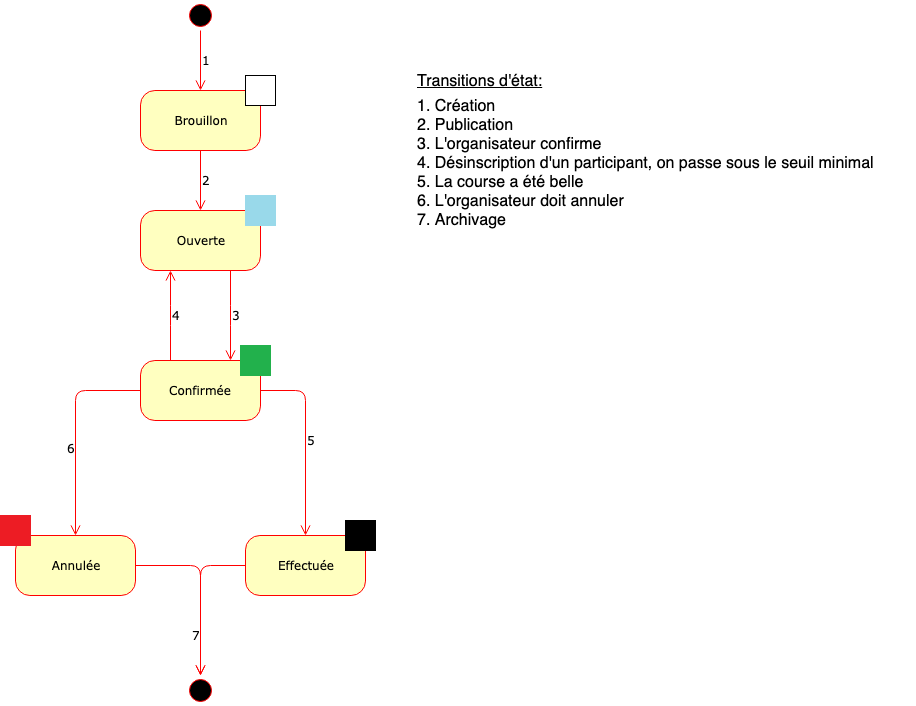

# Spécification initiale

Hixe fonctionne en complément du [site](http://www.clubalpinsion.ch) du Club Alpin Suisse, groupe de Sion (CASS).

L'accès à Hixe est limité aux membres du CASS, il est contrôlé au moyen du login/mot de passe de l'utilisateur sur le site.

Le site est fait avec Joomla, l'authentification se fait au moyen du [plugin Joomla IDP](https://plugins.miniorange.com/joomla-idp-saml-sso).

## Acteurs

Les personnes utilisant Hixe sont

- Les administrateurs, qui gèrent le site
- Les Chefs de Course (CdC), qui organisent des courses
- Les participants, qui prennent part aux courses
- Les visiteurs qui désirent voir le programme des courses

Les personnes ne sont pas cantonnées à un seul rôle. Un administrateur, par exemple, peut être CdC d'une course et participant dans une autre.

### Caractéristiques obtenues à partir du site

Lors de l'authentification auprès du site, Hixe récupère les informations suivantes au sujet de l'utilisateur:

- Prénom
- Nom
- Adresse email
- Numéro de membre

## Courses

### Caractéristiques

Les caractéristiques d'une course gérées par Hixe sont:
- Etat (voir ci-dessous)
- Le lieu (texte et/ou coordonnées)
- Date/heure de début
- Date/heure de fin
- Le type (rando, hors-piste, haute route, alpinisme, …)
- Type de formulaire d’inscription (deux types. Standard, je viens/viens pas. Avancé, Je désire un peu, beaucoup à la folie ou pas venir).
- Le Chef de Course
- Le rendez-vous :
  - Lieu (texte et/ou coordonnées possibilité d’aller chercher dans une liste)
  - L'heure de départ
- La difficulté (texte et une échelle de 1 à 5)
- Le dénivelé *
- Le nombre de maximum participants *
- Le matériel requis de chaque participant (liste type avec case à cocher + texte)
- Description (texte libre)
- Description complémentaire (texte libre visible que par les personnes inscrites)
- Groupe cible (Adultes, OJ, AJ)

### Etats

Une course est toujours dans un et un seul des états suivants:

Dans l'état 'Brouillon', le CdC est le seul à voir la course

Dans l'état 'Ouverte', les membres peuvent s'inscrire, la course n'est pas visible pour les visiteurs

## Calendriers

Le CASS a plusieurs groupes:
 - Adultes
 - Alpinisme Juvénile (AJ)
 - Organisation de Jeunesse (OJ)
  
Chacun a son calendrier de courses. Ils ne servent que comme filtre de présentation: chacun peut voir et publier des courses sur tous les calendriers.

## Cas d'utilisation

Les fonctionnalités de Hixe sont formulées au moyen des cas d'utilisation suivants

### Consulter les courses

#### Consulter mes courses

En tant que membre CASS, je veux voir toutes les courses me concernant.

Je me connecte sur Hixe, j'arrive sur la [page d'accueil](images/Home.png) qui me montre mes courses, regroupées selon leur état. Je peux cliquer sur une course pour en voir le détail

#### Consulter les courses d'un groupe

En tant que membre CASS, je veux voir les courses organisées pour un groupe particulier

Je consulte le [calendrier global](images/CalendrierGlobal.png) des courses, je sélectionne le ou les groupe(s) qui m'intéresse(nt) au moyen des cases à cocher. Les courses qui satisfont le critère de choix apparaissent/disparaissent à chaque changement de case à cocher.

#### Consulter les courses d'un membre

En tant qu'administrateur, je veux pouvoir consulter les courses d'un utilisateur précis

Je vais sur la [liste de toutes les courses](images/AllHikes.png), je la filtre avec le numéro du membre voulu

#### Consulter le programme

En tant que visiteur, je veux pouvoir voir la liste des courses du CASS

Je vais sur Hixe, mais je ne m'y connecte pas, n'étant pas membre du CASS.

Je peux néanmoins voir la [liste des courses prévues](images/HomeVisitor.png) par chaque groupe.

Je peux obtenir quelques informations générales en cliquant sur une course.

### Organiser une course

#### Créer une course

En tant que CdC, je veux pouvoir créer et publier une nouvelle course.

Je consulte le [calendrier global](images/CalendrierGlobal.png) des courses, je sélectionne [une date](images/CalendrierJour.png), j'ajoute une course

J'introduis les [caractéristiques de la course](images/Course.png), j'enregistre la course. A ce stade, je suis le seul à avoir accès à cette course.

Dans la foulée ou quelques jours plus tard, je publie ma course, elle est dès lors ouverte aux inscriptions.

#### Création par lot

En tant qu'administrateur je veux pouvoir créer plusieurs courses en une seule opération.

Je vais sur Hixe, connecté administrateur, je vais dans la page [création par lot](images/CourseLot.png), je remplis la table, en ajoutant des lignes au besoin ('+'), je soumets la liste.

Les courses sont créées, dans l'état brouillon. Les CdC devront finaliser les détails et publier eux-même.

#### Importation

En tant qu'administrateur je veux pouvoir créer plusieurs courses en les importants à partir d'un fichier Excel.

Je vais sur Hixe, connecté administrateur, je vais dans la page [création par lot](images/CourseLot.png), je clique sur 'importer', choisis mon fichier Excel. La page est remplie avec les données contenues dans le fichier, je soumets la liste.

Les courses sont créées, dans l'état brouillon. Les CdC devront finaliser les détails et publier eux-même.

#### Confirmer une course

En tant que CdC, je veux confirmer une course

Je vais sur les détails de ma course, je confirme la tenue de ma course. J'introduis un petit texte de confirmation, Hixe l'envoie par email à tous les participants

#### Refuser une inscription

En tant que CdC, je veux pouvoir refuser une inscription.

Je vais sur les détails de ma course, Je sélectionne les personnes qui ne pourront pas participer à ma course. J'introduis un petit texte explicatif, Hixe l'envoie par email aux participants sélectionnés

#### Annuler une course

En tant que CdC, je veux annuler une course

Je n'ai pas réuni assez de participants, ou la météo s'annonce catastrophique, ou autre raison...
 
Je vais sur les détails de ma course, j'annule ma course. J'introduis un petit texte d'explication, Hixe l'envoie par email à tous les participants

#### Clore une course

En tant que CdC, je veux clore une course effectuée

Je vais sur les détails de ma course, je clos ma course. Si je le désire, je peux enregistrer un texte de 'debrief'. Ce texte est stocké dans Hixe pour usage ultérieur. Il peut être envoyé ou non aux participants. Je peux également si je veux envoyer un texte plus personnel aux participants.

### Participer à une course

#### Choisir une course et s'y inscrire

En tant que membre CASS, je veux voir les courses offertes pour pouvoir éventuellement m'y inscrire.

Je consulte le [calendrier global](images/CalendrierGlobal.png) des courses, dans lequel les courses ouvertes qui correspondent à mon profil sont mises en évidence.

Je sélectionne une course, vérifie qu'elle correspond à mes attentes et je m'y inscris. Hixe envoie un email de confirmation d'inscription à l'organisateur (et moi-même en copie)

#### Se désinscrire d'une course

En tant que membre CASS, je veux pouvoir me désinscrire d'une course.

Pour une très bonne raison, je ne pourrai malheureusement pas participer à la course à laquelle je me suis inscrit.

Je vais sur la liste de mes courses, je sélectionne la course en question.

Je me désinscris. J'introduis un message d'explication. Si la course est simplement ouverte, le message est envoyé à l'organisateur uniquement. Si la course est déjà confirmée, le message est envoyé à l'organisateur et à tous les participants.

### Consulter des statistiques
#### Statistiques des courses
En tant qu’administrateur, je veux voir les statiques des courses, sous forme de liste et somme et filtrées par dates :
- Nombre de courses effectuées
- Nombre de courses modifiées (destination initiale et dest. de rempl. ou date, cause : météo, …)
- Nombre de courses annulées.
#### Statistiques des personnes
En tant qu’administrateur, je veux voir les statiques des personnes, sous forme de liste et somme et filtrées par dates :
- Nombre d’inscriptions
- Nombre de courses effectuées
- Nombre de courses désinscrites
- Nombre de courses refusées

<small><small>(v1.0, 8.10.2019)</small></small>
