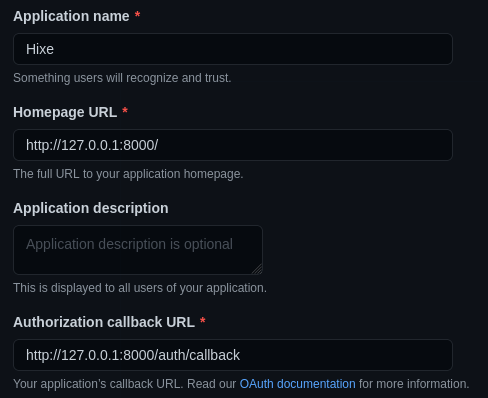

# Manuelle technique

- [Manuelle technique](#manuelle-technique)
  - [Gestion des styles CSS](#gestion-des-styles-css)
  - [Charte graphique](#charte-graphique)
  - [Gestion des champs dates sur le client](#gestion-des-champs-dates-sur-le-client)
  - [Popup-message](#popup-message)
    - [Description](#description)
    - [Utilisation](#utilisation)
    - [Paramètres](#paramètres)
      - [Les différents types sont :](#les-différents-types-sont-)
  - [Roles](#roles)
    - [Slug](#slug)
    - [Utilisations](#utilisations)
      - [Relation](#relation)
      - [Roles](#roles-1)
  - [OAuth](#oauth)
    - [Configuration](#configuration)
    - [Github](#github)
    - [Laravel](#laravel)
  - [Import csv](#import-csv)
    - [Model csv](#model-csv)

## Gestion des styles CSS

Les styles CSS sont écris en SCSS. Il respectent la méthodologie BEM.

## Charte graphique

[lien](graphical_charter/graphical_charter.md)

## Gestion des champs dates sur le client

Les champs dates sont géré par la librairie `bootstrap-datetimepicker`.
Il a été choisi d'utiliser une librairie plûtot que les champs HTML de base "date", "datetime-local" car ceux-ci ne sont pas
implémenter de la même façon sur tout les navigateurs.

La documentation pour cette librairie se trouve ici : https://getdatepicker.com/4/Functions/#viewdate

Les dates sont envoyés au serveur sous la forme d'un timestamp PHP.

## Popup-message

### Description

Les messages sont utilisés lorsque nous souhaitons aviser l'utilisateur de quelque chose.
Cela peut-être utile pour le rassurer lorsqu'une action est effectuée ou l'informer qu'une erreur s'est produite.

Exemple : Ajout d'une course, Inscription à une course.

**Note** : Pour rediriger un utilisateur sur une route avec un message spécifique, vous aurez besoin d'importer la librarie `Redirect`.

```
use Illuminate\Support\Facades\Redirect;
```

### Utilisation

Lorsque nous effectuons des actions dans un `controller`, nous pouvons maintenant rediriger l'utilisateur sur un routeur avec un message spécifique.

Example :

```
return Redirect::route('hikes.index')->with('warning','Hike supprimée !');
```

### Paramètres

> _..._->with(`type`, `message`);

#### Les différents types sont :

| Type    | Description                                    |
| ------- | :--------------------------------------------- |
| success | Affiche un message en vert de **succès**.      |
| warning | Affiche un message en jaune de **prévention**. |
| error   | Affiche un message d'**erreur** en rouge.      |
| info    | Affiche un message **informatif**.             |

## Roles

### Slug

Pour ne pas lier un id à un rôle spécifique un système de slug a été mis en place, ce système permet d'avoir un nom qui ne sera pas forcément affiché permettant de définir le rôle de manière technique.

Par exemple, pour le rôle "Administrateur" son slug correspondant pourrait être "admin".
globalement le slug doit permettre d'identifier un élément de manière simplifier, sans caractère interdit. Cela est utile notamment au niveau du code pour facilement identifier un rôle par un label compréhensible et efficace.

Définition wikipédia :

_Slug (publication web) est un court texte utilisable dans une URL et facilement compréhensible à la fois par les utilisateurs et les moteurs de recherche pour décrire et identifier une ressource. Noter que pour pouvoir figurer dans une URL, un slug ne doit pas comporter de caractères "interdits" (espaces, caractères diacritiques, etc.). Exemple : pour identifier une image de la Tour Eiffel, le slug Paris-Tour-Eiffel.jpg est plus "parlant' que 1234567.jpg._

### Utilisations

#### Relation

Le modèle "User" possède une méthode permettant de récupérer le nom du role sur l'instance d'un utilisateur avec `$user->role->name` pour plus d'info sur le fonctionnement de cette méthode voir [One To Many](https://laravel.com/docs/6.x/eloquent-relationships#one-to-many) et [One To Many (inverse) ](https://laravel.com/docs/6.x/eloquent-relationships#one-to-many-inverse)

#### Roles

L'on peut vérifier si l'utilisateur à un rôle en appelant la méthode `hasRole()` avec comment paramètre une chaine de caractère contenant le slug sur l'instance d'un user, exemple `$user->hasRole('admin')`
On peut également vérifier plusieurs rôles en même temps en lui passant un tableau contenant les différents slugs des rôles que l'on souhaiterait vérifier.

L'on peut ajouter un role à un utilisateur à l'aide de la méthode `setRole()` sur l'instance d'un user, exemple : `$user->setRole('admin')`

## OAuth

L'OAuth est actuellement fournie par Github

### Configuration

Pour utiliser Github en tant que Provider OAuth il faut [créer une nouvelle application](https://github.com/settings/applications/new).

### Github

Pour un environnement de développement:



Créez un nouveau `client secret`.

### Laravel

Ajoutez les variables suivantes au `.env` :

```
GITHUB_ID=<Client ID>
GITHUB_SECRET=<Client secrets>
GITHUB_URL=<Authorization callback URL>
```

## Import csv
L'importation de fichier csv sert à importer une multitude de course à l'aide d'un seul fichier csv.  
Si la course est valide, il y aura une coche en vert pour l'affirmer.   
**Note :**   
Si la course ne passe pas les validations, il ne pourra pas être importé et sera mis en évidence.  
Il y aura un message concernant l'erreur faite lors du survol.  
Les courses seront importées lorsqu'on aura cliqué sur le bouton sauver.
 
### Model csv
Le model sert à voir visuellement un exemple de comment entrer les différentes données des diverses courses.  
**Note :**   
L'exemple en question ne peut pas être importé.  
Le model csv est stocké dans `public/exports/model.csv`